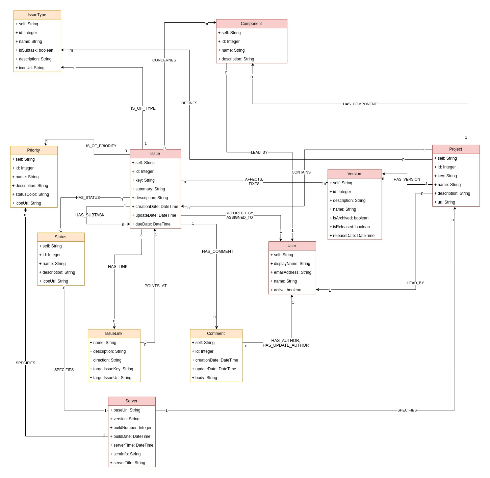

# jQAssistant Jira Plugin

This is a [Jira](https://www.atlassian.com/software/jira) parser for [jQAssistant](https://jqassistant.org/). 
It enables jQAssistant to scan and to analyze data from **Jira**.

## Getting Started

Download the jQAssistant command line tool for your system: [jQAssistant - Get Started](https://jqassistant.org/get-started/).

Next download the latest version from the release tab. Put the `jqa-jira-plugin-*.jar` into the plugins folder of the jQAssistant command
 line tool.
 
Finally, you need to configure the plugin via XML. The file must be named `jira-plugin-configuration.xml`:
 
```xml
<jira-configuration>

    <url>http://dummy-url.com</url>
    <credentials>
        <username>login-name-for-jira</username>
        <password>jira-password</password>
    </credentials>

    <projects>
        <project>
            <key>PX</key>
        </project>        
        <project>
            <key>PY</key>
        </project>
    </projects>

</jira-configuration>
```

IMPORTANT:
Please note that the username for Jira must be the one you can find in the profile section in Jira. The Jira UI allows
you to use your email as login name as well. This is not possible when querying the Jira REST API!

Now scan your configuration and wait for the plugin to finish:

```bash
jqassistant-commandline-neo4jv3-1.6.0/bin/jqassistant.sh scan -f jira-plugin-configuration.xml
```

You can then start a local Neo4j server to start querying the database at [http://localhost:7474](http://localhost:7474):

```bash
jqassistant-commandline-neo4jv3-1.6.0/bin/jqassistant.sh server
```


## Model



## Performance

A real benchmark does not make sense as the performance of the plugin depends on the performance of the Jira instance. Nevertheless, we 
want to provide some numbers which we received while testing the plugin against available Jira instances.

### Instance 1

The first Jira instance we scanned had the following entity counts:

| Entity Name | Count |
|-------------|-------|
| Issue       | ~7400 |
| User        | ~50   |
| Issue Link  | ~1400 |

The scan took a total of 11 minutes.

## Contribute

We really appreciate your help! If you want to contribute please have a look at the [CONTRIBUTING.md](CONTRIBUTING.md).
