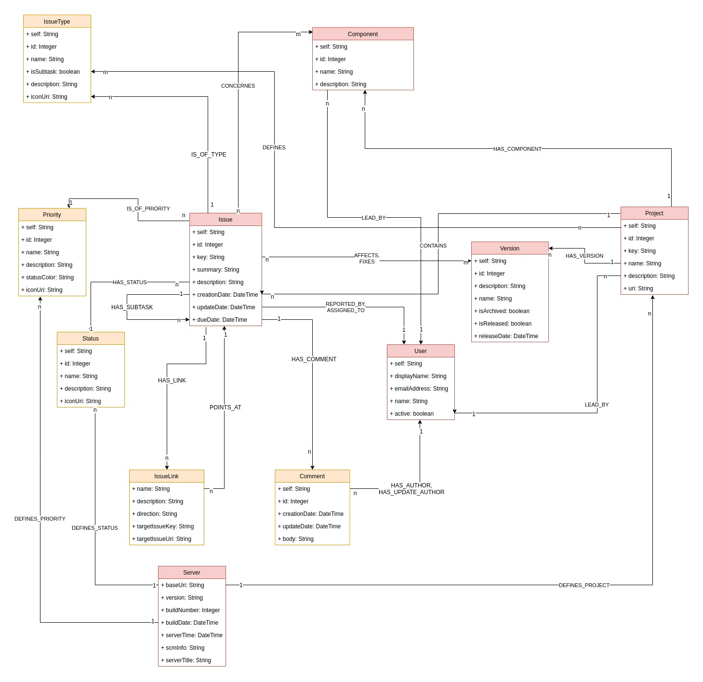

# jQAssistant Jira Plugin

This is a [Jira](https://www.atlassian.com/software/jira) parser for [jQAssistant](https://jqassistant.org/). 
It enables jQAssistant to scan and to analyze data from **Jira**.

## Getting Started

Download the jQAssistant command line tool for your system: [jQAssistant - Get Started](https://jqassistant.org/get-started/).

Next download the latest version from the release tab. Put the `jqa-jira-plugin-*.jar` into the plugins folder of the jQAssistant command
 line tool.
 
Finally, you need to configure the plugin via XML. The file must be named `jira-plugin-configuration.xml`:
 
```xml
<jira-configuration>

    <url>http://dummy-url.com</url>
    <credentials>
        <username>login-name-for-jira</username>
        <password>jira-password</password>
    </credentials>

    <projects>
        <project>
            <key>PX</key>
        </project>        
        <project>
            <key>PY</key>
        </project>
    </projects>

</jira-configuration>
```

IMPORTANT:
Please note that the username for Jira must be the one you can find in the profile section in Jira. The Jira UI allows
you to use your email as login name as well. This is not possible when querying the Jira REST API!

Now scan your configuration and wait for the plugin to finish:

```bash
jqassistant.sh scan -f jira-plugin-configuration.xml
```

You can then start a local Neo4j server to start querying the database at [http://localhost:7474](http://localhost:7474):

```bash
jqassistant.sh server
```

## Self-Signed Certificate

If your JIRA instance uses a self-signed certificate register it with the [Keytool](http://tutorials.jenkov.com/java-cryptography/keytool.html):

```bash
keytool -import -alias JIRA -file jira.crt -keystore $JAVA_HOME/jre/lib/security/cacerts
```

## Model



## Use Cases

### Overview

Count bugs per release:

```java
MATCH 
    (t:IssueType {name:'Bug'})<-[:IS_OF_TYPE]-(i:Issue)-[:AFFECTS]->(v:Version) 
RETURN 
    v.name as Version, count(i) as `Bug Total`
ORDER BY
    `Bug Total` DESC
```

Count bugs by priority:

```java
MATCH 
    (t:IssueType {name:'Bug'})<-[:IS_OF_TYPE]-(i:Issue)-[:IS_OF_PRIORITY]->(p:Priority) 
RETURN 
    p.name as Priority, count(i) as `Issue Total`
ORDER BY
    `Issue Total` DESC
```

Count issues by status:

```java
MATCH 
    (i:Issue)-[:HAS_STATUS]->(s:Status) 
RETURN 
    s.name as Status, count(i) as `Issue Total`
ORDER BY
    `Issue Total` DESC
```

### User Overview

Count reported issues per user:


```java
MATCH 
    (i:Issue)-[:REPORTED_BY]->(u:User) 
RETURN 
    u.name as User, count(i) as `Issue Total`
ORDER BY
    `Issue Total` DESC
```

Count assigned issues per user:

```java
MATCH 
    (i:Issue)-[:ASSIGNED_TO]->(u:User) 
RETURN 
    u.name as User, count(i) as `Issue Total`
ORDER BY
    `Issue Total` DESC
```

### Issue Relations

Show issues with few links to other issues. Those are probably ones which can always be implemented:

```java
MATCH 
    (i:Issue)
RETURN 
    i.key as Issue, SIZE((i)-[:HAS_LINK]->()) as `Link Total`
ORDER BY
    `Link Total` ASC
```

Show issues which are referenced by a lot of other issues. Those issues should be solved as soon as possible.

```java
MATCH 
    (i:Issue)
RETURN 
    i.key as Issue, SIZE((i)<-[:POINTS_AT]-()) as `Reference Total`
ORDER BY
    `Reference Total` DESC
```

### Issue Quality

Show issues with a lot of comments. Probably the first description was not clear enough:

```java
MATCH 
    (i:Issue)
RETURN 
    i.key as Issue, SIZE((i)-[:HAS_COMMENT]->()) as `Comment Total`
ORDER BY
    `Comment Total` DESC
```

## Supported Jira Versions

Unfortunately, we did not find any documentation which Jira versions are supported by the [JIRA REST Java Client](https://mvnrepository.com/artifact/com.atlassian.jira/jira-rest-java-client-api/5.1.1-e0dd194).
According to the [BitBucket repository description](https://bitbucket.org/atlassian/jira-rest-java-client/src/master/) 
every version newer than JIRA 4.2  is supported:

> Java client library (useful for any JVM languages) which allows to communicate with JIRA via its new REST API (JIRA 4.2 and newer).

The README.md references a [Wiki entry](https://ecosystem.atlassian.net/wiki/spaces/JRJC/overview) from 2010. 
This again references an [ATLASSIAN Marketplace page](https://marketplace.atlassian.com/apps/39474/rest-java-client-for-jira/version-history) which is out of date since 2013.

If it does not work with your Jira instance please open an **Issue** and write your Jira version in there.

## Performance

A real benchmark does not make sense as the performance of the plugin depends on the performance of the Jira instance. Nevertheless, we 
want to provide some numbers which we received while testing the plugin against available Jira instances.

| Instance | Issue Count | User Count | Issue Link Count | Time to Scan |
|----------|-------------|------------|------------------|--------------|
| #1       | ~7400       | ~50        | ~1400            | ~9 min       |
| #2       | ~1550       | ~1400      | ~100             | ~5 min       |

## Rate Limits

When running against a Jira cloud instance there could be an issue with rate limits. For more information please see the [CONTRIBUTING.md](CONTRIBUTING.md).

## Contribute

We really appreciate your help! If you want to contribute please have a look at the [CONTRIBUTING.md](CONTRIBUTING.md).
